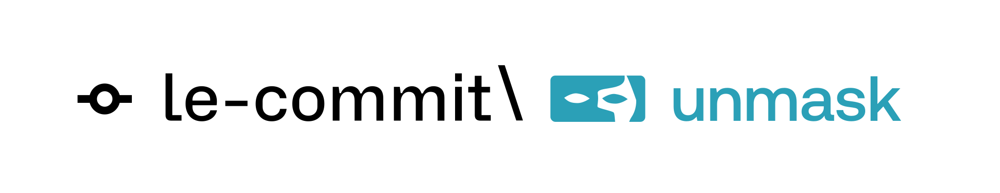

<div align="center">
  
</div>

# Unmask - AI-Powered Hiring Verification Platform

**Trust your hiring process again.**

Unmask is an intelligent hiring verification platform that helps you verify candidate authenticity through comprehensive analysis of CVs, LinkedIn profiles, GitHub accounts, and automated reference calls. Built for **mosAIc: AI in action with The Product Folks 2025** • Vultr Track.

---

## ✨ Features

### 🔍 **Multi-Source Profile Analysis**
- **CV Processing**: Extracts and analyzes professional experience, education, skills, and credentials
- **LinkedIn Integration**: Cross-references LinkedIn data with CV information for consistency
- **GitHub Analysis**: Evaluates coding activity, repository quality, and technical skills
- **Credibility Scoring**: AI-powered authenticity assessment with detailed flags and recommendations

### 📞 **Automated Reference Calling**
- **AI-Powered Calls**: Automatically calls references using ElevenLabs Conversational AI
- **Natural Conversations**: Professional, human-like interactions with references
- **Transcript Analysis**: Real-time transcription and AI-powered summarization
- **Reference Validation**: Cross-checks reference feedback with candidate claims

### 🎯 **Real-Time Interview Support**
- **Live Feedback**: Get real-time prompts during candidate interviews
- **Inconsistency Detection**: Flags discrepancies between sources on-the-fly
- **Suggested Questions**: AI-generated follow-up questions based on analysis
- **Interview Transcripts**: Live transcription with highlighted concerns

### 📊 **Comprehensive Dashboard**
- **Candidate Profiles**: Unified view of all candidate information
- **Processing Pipeline**: Real-time status tracking from upload to analysis
- **Flag Management**: Visual indicators for potential concerns
- **Export Reports**: Detailed hiring decision support documents

---

## 🛠️ Technology Stack

### **Frontend**
- **Next.js 15** - React framework with App Router
- **TypeScript** - Type-safe development
- **Tailwind CSS** - Modern styling framework
- **Radix UI** - Accessible component primitives
- **Framer Motion** - Smooth animations

### **Backend & Storage**
- **Supabase** - PostgreSQL database with real-time capabilities
- **Supabase Storage** - Secure file storage for CVs and documents
- **Ashby ATS Integration** - Seamless candidate import and sync

### **AI & Analysis**
- **Groq API** - Fast AI inference for document analysis
- **OpenAI GPT-4** - Advanced reasoning and summarization
- **ElevenLabs** - Natural voice AI for reference calls
- **PDF Processing** - Automated document parsing and extraction

### **Infrastructure**
- **Docker** - Containerized deployment
- **Vultr** - Cloud hosting platform
- **Real-time Processing** - Async job processing

---

## 🚀 Quick Start

### **Prerequisites**
- Node.js 18+
- Docker (for production deployment)
- API keys for external services

### **Development Setup**

1. **Clone the repository**
   ```bash
   git clone https://github.com/hr7657316/unmask.git
   cd unmask
   ```

2. **Install dependencies**
   ```bash
   cd frontend
   pnpm install
   ```

3. **Configure environment variables**
   ```bash
   cp .env.example .env.local
   ```

   Required environment variables:
   ```env
   # Supabase
   NEXT_PUBLIC_SUPABASE_URL=your_supabase_url
   NEXT_PUBLIC_SUPABASE_ANON_KEY=your_anon_key
   SUPABASE_SERVICE_ROLE_KEY=your_service_role_key

   # AI Services
   GROQ_API_KEY=your_groq_api_key
   OPENAI_API_KEY=your_openai_api_key

   # Reference Calling (ElevenLabs)
   ELEVENLABS_API_KEY=your_elevenlabs_api_key
   ELEVENLABS_AGENT_ID=your_agent_id
   ELEVENLABS_AGENT_PHONE_ID=your_phone_id

   # Twilio (via ElevenLabs)
   TWILIO_ACCOUNT_SID=your_twilio_sid
   TWILIO_AUTH_TOKEN=your_twilio_token
   TWILIO_PHONE_NUMBER=your_twilio_number

   # Ashby ATS Integration
   ASHBY_API_KEY=your_ashby_api_key
   ```

4. **Start local supabase**
   ```bash
   supabase start
   supabase db reset --local
   ```

5. **Start development server**
   ```bash
   pnpm dev
   ```

6. **Open your browser**
   ```
   http://localhost:3000
   ```

---

## 🔄 Webhook Queue Processing with pg_cron

The application uses **pg_cron** for automated webhook queue processing in both local development and production environments.

### **Automatic Processing Everywhere**

✅ **Local Development**: pg_cron extension automatically installed  
✅ **Production**: pg_cron pre-available in Supabase Cloud  
✅ **Queue Processing**: Automatic every 2 minutes in both environments  

### **Zero Configuration Required**

```bash
# Just start development - queue processing works automatically!
pnpm dev
```

**How it works:**
1. Database migrations auto-install `pg_cron` extension
2. Cron job created automatically: processes queue every 2 minutes
3. Local development uses `host.docker.internal:3000`
4. Production uses configured webhook base URL

### **Production Setup**

**Optional**: Configure production webhook URL for external deployments:

```sql
-- Set production webhook base URL (optional)
ALTER DATABASE your_production_db_name 
SET app.webhook_base_url = 'https://your-domain.com';
```

### **Queue Monitoring**

Monitor queue status and cron job health:

```sql
-- View pending webhooks
SELECT webhook_type, status, priority, created_at, payload->'applicantId' as applicant_id 
FROM webhook_queue 
WHERE status IN ('pending', 'failed') 
ORDER BY priority DESC, created_at ASC;

-- Check pg_cron job status
SELECT jobid, schedule, active, jobname FROM cron.job 
WHERE jobname = 'process-webhook-queue';

-- Use helper function for detailed status
SELECT * FROM check_webhook_queue_cron_status();
```

### **Manual Processing (Optional)**

For debugging or immediate processing:

```bash
# Local development
curl -X POST "http://localhost:3000/api/webhooks/process-queue" \
  -H "Authorization: Bearer webhook-secret-dev" \
  -H "Content-Type: application/json"

# Production  
curl -X POST "https://your-domain.com/api/webhooks/process-queue" \
  -H "Authorization: Bearer your-webhook-secret" \
  -H "Content-Type: application/json"
```

### **Queue Types & Priority**

| Webhook Type | Priority | Purpose |
|--------------|----------|---------|
| `score_push` | Based on AI score (1-100) | Push updated credibility scores to Ashby ATS |
| `note_push` | 90 (high priority) | Push analysis notes and red flags to Ashby |

**Priority Processing**: Higher scores processed first (score 85 = priority 85)

---
